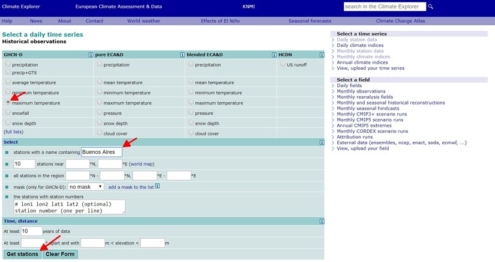
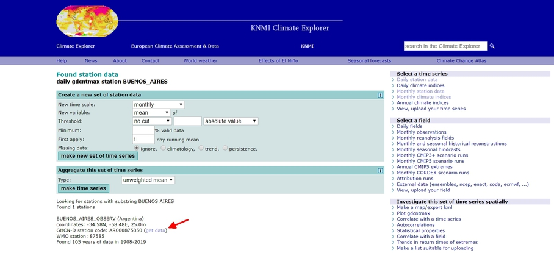
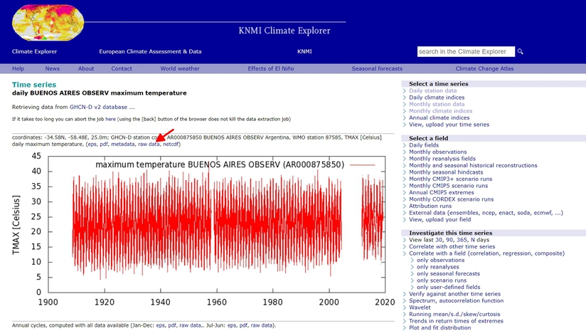
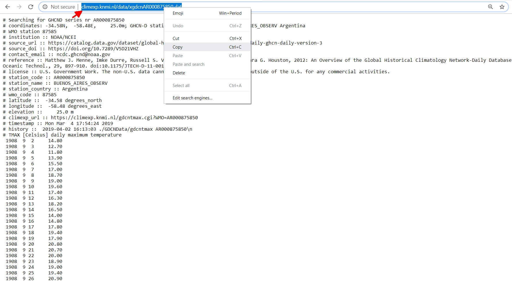
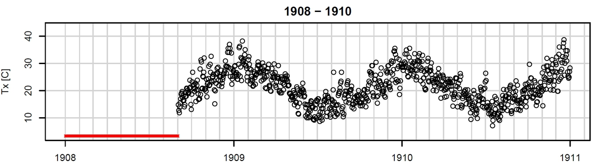
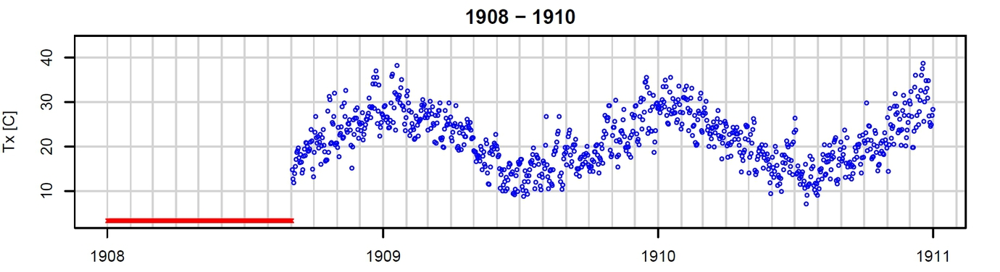
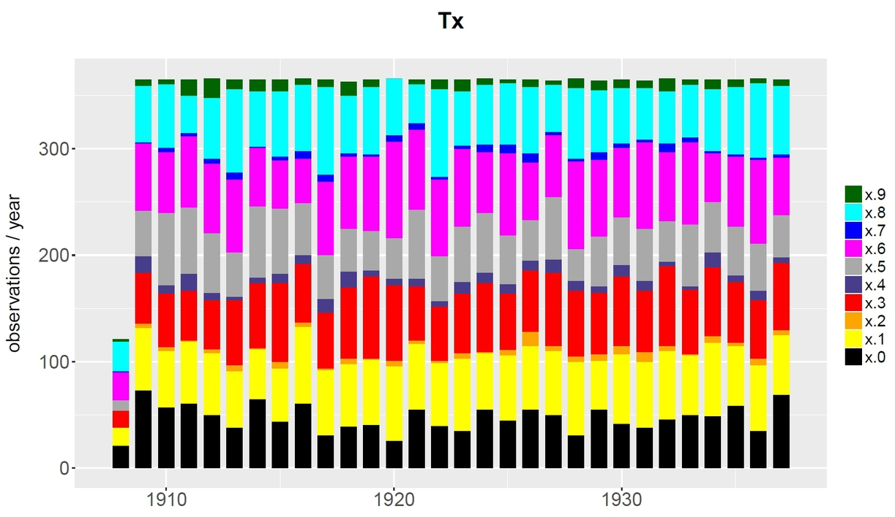
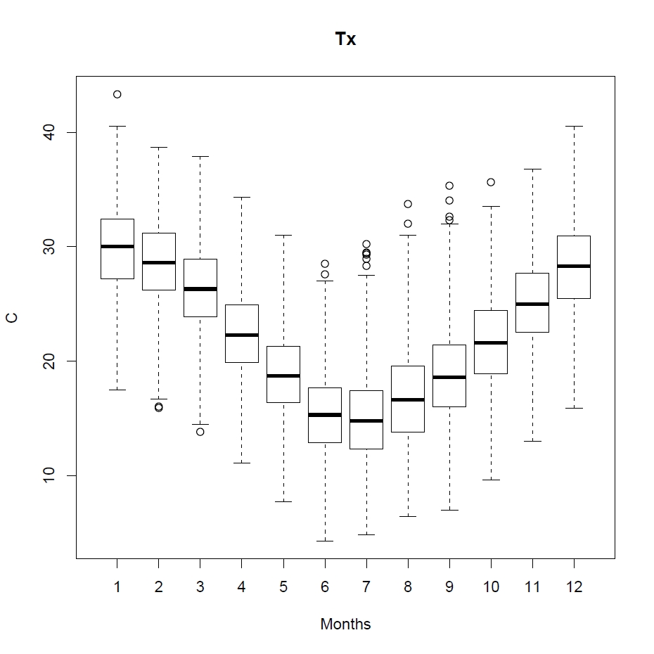
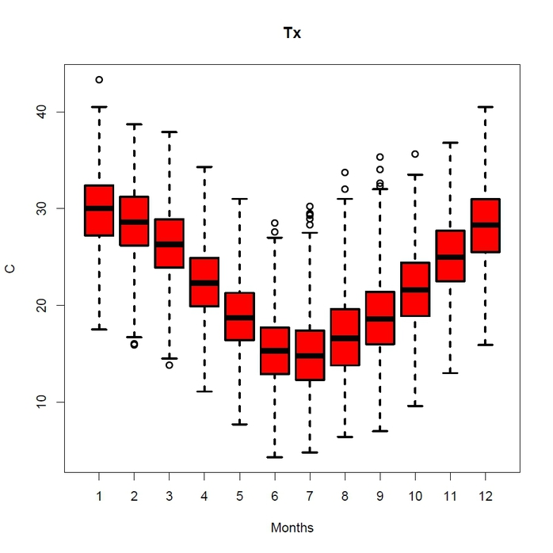
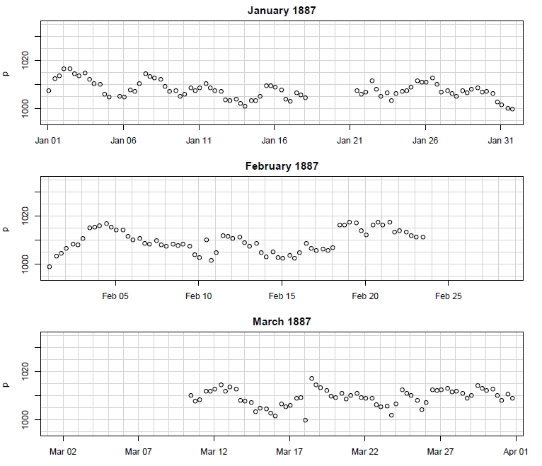

```{r setup, include = FALSE}
knitr::opts_chunk$set(
  collapse = TRUE,
  comment = "#>"
)
```

<br>

<center>
```{r, echo=FALSE, warning=FALSE}

```
</center>

<br>

## Introduction

This page illustrates the use of the package `dataresqc` by means of practical examples. In the first part, a daily data series is downloaded from Climate Explorer, converted to the Station Exchange Format, analysed visually, tested
with the automatic tests, and finally flagged. In the second part, a recently digitized sub-daily pressure series for Rosario de Santa Fe is analyzed.

For instructions on how to install `dataresqc`, see [here](https://github.com/c3s-data-rescue-service/dataresqc/wiki).

<br>

## 1 Daily data

### 1.1 Download data from Climate Explorer and convert it to SEF

In this example we will look for quality problems in a daily maximum temperature series.

First of all, open R and load `dataresqc` using:

```{r, warning=FALSE}
library(dataresqc)
```

Then choose a working directory where the output will be saved (if necessary, you can create a new directory with `dir.create`):

```r
dir.create("my_path/my_dir")
setwd("my_path/my_dir")
```

Now open <a href="http://climexp.knmi.nl/selectdailyseries.cgi" target="_blank">Climate Explorer</a>. Select "maximum temperature" in the "GHCN-D"" panel, write the name of a city in the "Select" panel, and click on "Get stations":

```{r, echo=FALSE}

```

You should now get one or more entries of records for the required city (if none appears, try a different city). Click then on "get data":

```{r, echo=FALSE}

```

In the next window, click on "raw data":

```{r, echo=FALSE}

```

Finally, copy the url of the data file from the address bar of the browser:

```{r, echo=FALSE}

```

Paste the url into the following command in R (do not forget the quotes):

```{r, eval=FALSE}
climexp_to_sef("<url>")
```

This command will create a SEF file in your working directory containing the 
data for the city that you selected. The name of the file is given automatically by the software
and includes: source ID, station ID, start date, end date, and variable code.

Assign the name of the file to the variable `myfile`, so that you do
not have to remember it later (in this example the filename is that of the Buenos Aires station,
you will have a different filename):

```{r}
myfile <- "GHCN-D_AR000875850_19080902-20190331_Tx.tsv"
```

Now you are ready to apply any of the functions included in `dataresqc` to the data that
you downloaded.

<br>

### 1.2 First plot

Let us start with a simple plot. For that, you can use the function `plot_daily`:

```{r}
plot_daily(myfile)
```

The plot will be saved in the file 'Tx.pdf' in your working directory and will look like this:

```{r, echo=FALSE}
knitr::include_graphics("plot_daily.jpg")
```

One panel is plotted for each year. You can plot more than one year per panel, for instance three, using the parameter *len* (here we give a different name to the file to avoid overwriting the old one):

```{r}
plot_daily(myfile, len = 3, outfile = "Tx3.pdf")
```

```{r, echo=FALSE}

```

It is also possible to change most of the graphical parameters. For example, to make the points smaller and change their color:

```{r}
plot_daily(myfile, len = 3, cex = 0.5, col = "blue", outfile = "Tx_blue.pdf")
```

```{r, echo=FALSE}

```

To see which other parameters you can change, call the function documentation with:

```r
?plot_daily
```

<br>

### 1.3 Plot distribution of decimals

Now we can look at the actual reporting resolution of the data, by using the function `plot_decimals`:

```{r}
plot_decimals(myfile, outfile = "decimals.pdf")
```

```{r, echo=FALSE}

```

In this example, certain decimals (.2, .4, .7, .9) are much less frequent than the others, suggesting that
the actual resolution of the data is somewhat coarser than 0.1°C (this probably involved multiple roundings and conversions).

<br>

### 1.4 Look for outliers

The function `climatic_outliers` looks for values in the tails of the distribution. You can set the threshold that defines the outliers as a multiple of the interquartile range. For example:

```{r}
climatic_outliers(myfile, IQR=2)
```

will return all values that are more than 2 interquartile ranges smaller than the 25th percentile or more than 2 interquantile ranges larger than the 75th percentile (the test is done for each month separately).

If any value that exceeds these thresholds is found, a text file starting with 'qc_' will be created in the working directory. It will look like this:

```
Var	Year	Month	Day	Value	Test
Tx	1918	7	30	28.9	climatic_outliers
Tx	1940	3	25	13.8	climatic_outliers
Tx	1944	9	29	34	climatic_outliers
Tx	1946	9	11	32.3	climatic_outliers
Tx	1951	6	14	28.5	climatic_outliers
Tx	1957	1	29	43.3	climatic_outliers
Tx	1965	6	19	27.6	climatic_outliers
Tx	1979	7	29	30.2	climatic_outliers
Tx	1979	7	30	28.3	climatic_outliers
Tx	1979	7	31	29.5	climatic_outliers
Tx	1993	2	8	15.9	climatic_outliers
Tx	1993	2	9	16	climatic_outliers
Tx	1995	9	6	32.6	climatic_outliers
Tx	1996	8	24	33.7	climatic_outliers
Tx	1997	7	28	29.4	climatic_outliers
Tx	1997	7	29	29.3	climatic_outliers
Tx	2002	8	25	32	climatic_outliers
Tx	2013	9	11	35.3	climatic_outliers
Tx	2014	10	28	35.6	climatic_outliers
```

On request, this function also produces a boxplot and saves it into a pdf:

```{r}
climatic_outliers(myfile, IQR = 2, bplot = TRUE, outfile = "boxplot.pdf")
```

```{r, echo=FALSE}

```

Again, it is possible to change most graphical parameters:

```{r}
climatic_outliers(myfile, IQR = 2, bplot = TRUE, col = "red", lwd = 2, outfile = "boxplot_red.pdf")
```

```{r, echo=FALSE}

```

<br>

### 1.5 Apply all quality tests

The function `qc` automatically applies all possible quality tests. Its use is very simple:

```{r}
qc(myfile)
```

For a single maximum temperature series, it will apply five tests (climatic outliers, temporal coherence, repetitions, duplicate dates, big errors). Note that the thresholds cannot be customized when you use `qc`.

The additional suspicious values found by the tests will be added to the text file that you already created with `climatic_outliers`.

<br>

### 1.6 Add flags to the SEF file

The last step of the quality control process is to add flags to the data file. This is done with the function `write_flags`:

```{r}
write_flags(myfile, "qc_AR000875850_Tx_daily.txt", outpath = ".", note = "qc")
```

Here 'qc_AR000875850_Tx_daily.txt' must be replaced by the name of your text file containing the table of suspicious values. A new SEF file is created in the working directory (`outpath = "."`) and its name will be the same of the input file with an additional '_qc' at the end (set by the parameter *note* to avoid overwriting the input file).

If you want, you can remove lines from the table of suspicious values, if you think they are false alarms. Or you can add new lines based on the plots or other forms of data inspection (remember that the columns must be separated by tabs, **not** spaces). Keep in mind that the last column in the table will become the flag description in the SEF file.

If everything went fine, when you open the new SEF file you should find instances like this:

```
1918	7	29			day	23.8	
1918	7	30			day	28.9	qc=climatic_outliers
1918	7	31			day	15.3	
```

Moreover, the name and version of the software that was used is printed in the header.

<br>

### 1.7 Internal consistency test

The internal consistency test for maximum and minimum temperature simply checks that the minimum temperature is
not larger than the maximum temperature. For this test, you will need a minimum temperature series for the
same station you selected before. You can get the minimum temperature series by repeating the procedure described in Section 1.1 and selecting 'minimum temperature' in the first page. Then:

```{r, eval=FALSE}
climexp_to_sef("<url>")
```

```{r}
myfile2 <- "GHCN-D_AR000875850_19080902-20190331_Tn.tsv"
```

Now you only need to use the function `internal_consistency`:

```{r}
internal_consistency(c(myfile, myfile2))
```

If no inconsistent values are found, then nothing will happen. Otherwise, the inconsistent values will be added to the usual text file, plus a new file will be created for the minimum temperature.

<br>

### 1.8 Exercises

- Download a precipitation series from Climate Explorer; try the function `plot_weekly_cycle` (remember: you can check the function documentation with `?plot_weekly_cycle`, or you can have a look at the [wiki](https://github.com/c3s-data-rescue-service/dataresqc/wiki))

- Download a snowfall and a snow depth series for the same station from Climate Explorer; try to run the internal consistency test (function `internal_consistency`).

<br>

## 2 Sub-daily data

### 2.1 Bern and Rosario data

The Station Exchange Format is not the only input format that `dataresqc` can read. [Data frames](http://adv-r.had.co.nz/Data-structures.html#data-frames) are also accepted; however, it is a little more complex to use them, because an additional data frame with metadata must be provided for most functions.

Recently digitized data for Bern (Switzerland) and Rosario de Santa Fe (Argentina) are stored in the variables `Bern` and `Rosario`, respectively. These variables are structured as lists, where every element of the list is a data frame containing one specific variable. We will analyze pressure in Rosario (1886-1900), so we will need the variable `Rosario$p`.

<br>

### 2.2 Sub-daily plot

To plot the data points we use the function `plot_subdaily`:

```{r}
plot_subdaily(Rosario$p, year = 1887)
```

```{r, echo=FALSE}

```

This will plot only the year 1887 (one pdf per year is created), with one panel for each month (for simplicity, panels after March are omitted in the figure above). As usual, graphical parameters can be edited.

<br>

### 2.3 Apply all quality tests

Similarly to the daily data, we can perform all available tests at once with the function `qc`. Here, however, we must provide metadata (stored in the list `Meta`) and indicate that the resolution of the data is sub-daily. Moreover, since the time is in UTC, we must provide an offset to be added to obtain local time (in this case minus 4 hours 17 minutes, i.e. the standard time in Argentina at the end of the 19th century). 

All this is done by the following line:

```{r}
qc(Rosario$p, Metadata = cbind(Meta$p[2,],"subdaily"), time_offset = -4.28)
```

The resulting table of suspicious values should include 29 entries:

```
Var	Year	Month	Day	Hour	Minute	Value	Test
p	1895	8	31	12	17	102.71	climatic_outliers;wmo_time_consistency;wmo_gross_errors
p	1895	8	31	22	17	1031.64	wmo_time_consistency
p	1896	2	14	12	17	1012.04	wmo_time_consistency
p	1896	2	14	22	17	928.15	climatic_outliers;wmo_time_consistency
p	1896	3	8	12	17	1008.83	wmo_time_consistency
p	1896	3	8	22	17	76.9	climatic_outliers;wmo_time_consistency;wmo_gross_errors
p	1896	3	16	12	17	1015.27	wmo_time_consistency
p	1896	3	16	22	17	1277.61	climatic_outliers;wmo_time_consistency;wmo_gross_errors
p	1896	4	1	12	17	1278.44	climatic_outliers;wmo_time_consistency;wmo_gross_errors
p	1896	4	1	22	17	1010.39	wmo_time_consistency
p	1896	4	2	12	17	1275.56	climatic_outliers;wmo_time_consistency;wmo_gross_errors
p	1896	4	2	22	17	1008.15	wmo_time_consistency
p	1897	4	10	12	17	1279.96	climatic_outliers;wmo_time_consistency;wmo_gross_errors
p	1897	4	10	22	17	1014.62	wmo_time_consistency
p	1898	2	1	12	17	29.4	climatic_outliers;wmo_time_consistency;wmo_gross_errors
p	1898	2	1	22	17	1000.27	wmo_time_consistency
p	1898	7	16	12	17	1027.23	wmo_time_consistency
p	1898	7	16	22	17	895.4	climatic_outliers;wmo_time_consistency
p	1898	12	9	12	17	1008.45	wmo_time_consistency
p	1898	12	9	22	17	1044.74	climatic_outliers;wmo_time_consistency
p	1898	12	10	12	17	999.96	wmo_time_consistency
p	1898	12	10	22	17	969.09	climatic_outliers;wmo_time_consistency
p	1898	12	31	12	17	1035.65	climatic_outliers;wmo_time_consistency
p	1898	12	31	22	17	1005.38	wmo_time_consistency
p	1899	2	3	12	17	1003.55	wmo_time_consistency
p	1899	2	3	22	17	604.98	climatic_outliers;wmo_time_consistency
p	1899	7	25	12	17	1008.59	wmo_time_consistency
p	1899	7	25	22	17	977.68	wmo_time_consistency
p	1900	5	20	12	17	973.42	climatic_outliers
```

Many of them are clearly related to digitization errors (typos) and can be corrected if the original data source is available.

<br>

## 3 Feedback

We appreciate any feedback. You can use [this anonymous Google Form](https://forms.gle/JUEkNeGW9YhJe6NH6) or write an email to yuri.brugnara@giub.unibe.ch.